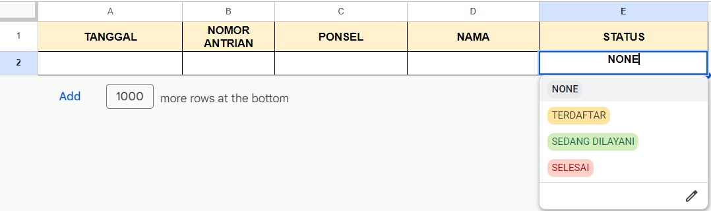
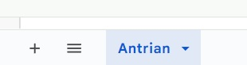

# Whatsapp Bot Queue

A whatsapp bot with commands to put someone into a queue list with Google Spreadsheet as the database.

## Installation

Clone this repository and install the packages

```bash
git clone https://github.com/Hreesang/whatsapp-bot-queue
cd whatsapp-bot-queue
npm install
```

Once you have finished installing the packages. Set the environment variables by following `.env.example`. Then, execute this command.

```bash
npm run build
npm run start
```

## Spreadsheet

Design your spreadsheet like the example below.



Name your sheet as `Antrian` like the example below.



## Credits

I code this bot myself, [Hreesang](https://github.com/Hreesang).
